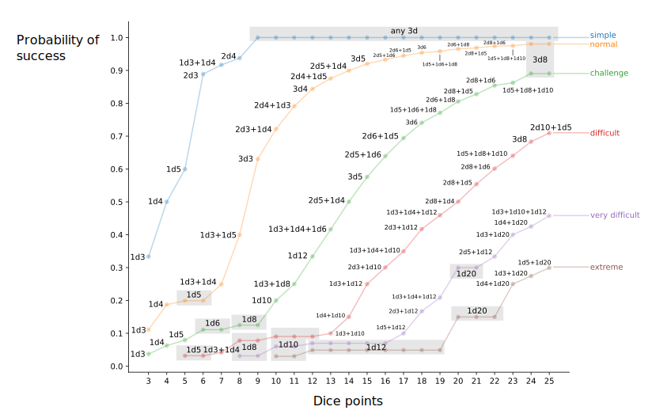

* # Choosing dice for action resolution in Lex Arcana
* 
* Statistics is today one of most widely applied branch of science in everyday life, albeit this often happens under
* the hood of the technology we use. However not many knows that, as a science, statistics was born for a very narrow 
* purpose: fins strategies that minimize losses in games of chances.
* 
* Today I would like to go back to statistics origins by sharing a side-gig analysis I did after having put my 
* greasy player hands on the manual of the role play game Lex Arcana from Acheron Games. Lex Arcana has, to my knowledge
* a unique feature that sets it apart from other RPGs: by design, players can constantly tweak the statistical 
* distribution used to resolve an action. Being both a rpg-power-player and a data scientist, this left me with a burning
* question: is there a tweaking strategy that maximizes the chances of successful actions in Lex Arcana? A bit of python
* thinkering suggests that yes, there indeed is one! Let's see which one
* 
* For simplicity the post is structured as follows. First I will give an overview of what action resolution in RPG means, 
* so that you don't need to be an RPG enthusiast to enjoy this article. Then I will explain how Lex Arcana differs in 
* action resolution from other games. After that, I will discuss the optimal strategy to maximize the chances of 
* successful actions. Finally, I will discuss a suboptimal strategy that approximate the optimal strategy, but requires 
* less a priori knowledge from the player side. For those interested, full code for the analysis is available at this 
* [public github repo](https://github.com/davide-chiuchiu/lex-arcana-statistic).
* 
* ## Overview of action resolution in RPGs
* 
* For those that are not familiar with RPG jargon, action resolution is a core mechanic that determines if a player
* manages to do something or not. The specifics depend on the game, but it involves these steps
* 
* 1. A player declares an action that it want to perform.
* 2. A referee quantifies how difficult the action is with a target number.
* 3. The player throws one or more dice and applies some modifiers on the total results.
* 4. If the dice result is above the target number, than the player performs the action successfully. If not, the action
*    fails.
* 
* Step 3 is where game design and statistic conspire to make your game memorable... or not. In general, many RPGs stick to
* a tried and tested formula provided exemplified by the d20 school: players always roll a single die with 20 
* faces (d20), and then apply some modifiers to the results. It's a dry but effective recipe that combines the relative
* intuitiveness of a uniform distribution with a decent spectrum of possible results. On the other side, broad uniform 
* distribution means that players can fail an action even when they have exceptional modifiers. Some players are extremely 
* frustrated by this "volatility", especially if they are impersonating a character that is supposedly good at doing 
* something. Many games offset this by allowing players to throw more than one dice and then sum the result. This strategy
* makes it more likely to end up an average result, which translates into the idea that players are impersonating a 
* character that it's good ad doing something. At the same time undeserved failures becomes rare, although this happens 
* to outsinding succeses too. Lex Arcana follows this idea, but with a couple of nice twists.
* 
* ## Overview of action resolution in RPGs
* 
* In Lex Arcana each player has a game feature called "Dice points". It's a number between 3 and 25 that determines how
* good a player is at doing something. When asked to resolve an action, a player can roll any combination of 
* 1, 2 or 3 dice as long as the best possible outcome is lower or equal to the Dice point. For example, a player with
* 12 dice point can roll 2 dice with 6 faces (2d6), or three dice with 4 faced (3d4). The two choices subtend two 
* different statistical distributions, each one with different trade-offs in terms of observing average and extreme 
* outcomes.
* 
* This freedom of choice in the distribution to sample is what sold me the game in the first place. However, it also left
* me with a nagging curiosity: given that not all distributions are equal, which one should I pick to maximize my 
* chances of success when I play Lex Arcana?
* 
* ## Optimal strategy in picking the dice to throw when playing Lex Arcana
* 
* To answer my curiosity I resorted to some quick and dirty Monte Carlo simulation cobbled together with python. 
* Specifically I computed the probability to succeed against pre-determined target numbers for action difficulty
* using every possible combination of 1, 2 and 3 dices that are compatible with Dice point values between 3 and 25. 
* Using these probabilities, I identified the dice combination that yield the highest success probability for a given
* choice of action difficulty and Dice point value. To keep the information readable, dice combinations are labeled using 
* standard [dice notation](https://en.wikipedia.org/wiki/Dice_notation), while difficulties are identified with the 
* qualitative labels `simple`, `normal`, `challenge`, `difficult`, `very difficult`, `extreme` indicating a target number 
* of 3, 6, 9, 12, 15, and 18 respectively. 
* 
* The figure below summarizes which combination of dice pick for a given combination of difficulty and Dice points, 
* together with the corresponding probability of success. 

Upon assuming that the difficulty of an action is know, a player can always pick the optima dice pool corresponding to a
given value of Dice points. However, the optimal choice is not always trivial. For example, there are some 
counterintuitive instances where one has to pick combinations of dice that add up to less than the Dice point value so 
to maximize success chances, see for example what happens for value of Dice points equal to 7 or 9. In addition, a good 
choice for a given difficulty could be a bad one for another at fixed value of Dice points. This nuanced variability 
means that players unaware of the optimal strategy are likely to make bad choices in picking dice combination without 
even realizing.

To be fair, it's even possible that players will never be able to pursue an optimal strategy. A referee is not 
obliged to state the difficulty of an action before a player rolls. Players can make educated guesses based on cues, but
the ambiguity can nudge a player toward outright bad choices. Therefore, a player should aim for a good enough 
approximation of the optimal strategy that does not rely on prior knowledge of the action difficulty

## Good strategy in picking the dice to throw when playing Lex Arcana

As hinted above, a good strategy to pick dice combinations for players should not rely on prior knowledge of the action
difficutly, but only on the Dice points. Moreover, it also must be as close as possible to the optimal one. 
To find one, it's enough to look for the dice choice that, at fixed Dice points, has the smallest mean absolute 
deviation from the optimal success probabilities across all every difficulty. This analysis yields

The analysis yields the following approximation of the optimal strategy

|Dice Points| Dice    |
|:----:|:-------------|
|  3   | 1d3          |
|  4   | 1d4          |
|  5   | 1d5          |
|  6   | 1d6          |
|  7   | 1d3+1d4      |
|  8   | 1d8          |
|  9   | 1d4+1d5      |
|  10  | 1d10         |
|  11  | 1d5+1d6      |
|  12  | 1d12         |
|  13  | 1d5+1d8      |
|  14  | 1d4+1d10     |
|  15  | 1d5+1d10     |
|  16  | 1d6+1d10     |
|  17  | 1d5+1d12     |
|  18  | 1d8+1d10     |
|  19  | 1d3+1d6+1d10 |
|  20  | 1d20         |
|  21  | 1d3+1d6+1d12 |
|  22  | 1d10+1d12    |
|  23  | 1d3+1d20     |
|  24  | 1d4+1d20     |
|  25  | 1d5+1d20     |

This strategy does not depend on prior knowledge of the action difficulty, but it provides success probabilities that 
are close enough to the optimal strategy. Specifically, a player can expect a success probability that it's typically 
3 to 6 percent points lower than the optimal one. Worst case scenario are a few edge cases where the approximated 
strategy has a success probability that it's 10 percent points lower than the optimal one, but this happens because of 
large deviations from simple actions rather than difficult ones. 

## Conclusions

This analysis aimed to identify the optimal strategy in choosing dices for action resolution in Lex arcana. By crunching
numbers with a bit of Python I was able to identify the true optimal strategy, but the requirements on perfect knowledge
on the action difficulty may limit its application in real games. As I consequence I also identified a strategy that 
does not require prior knowledge of the action difficulty, but it's, on average, as close as possible to the optimal
one. 

Okay, now that I have the tools, it's time for me to go out and play some Lex Arcacna. You should do that too.
